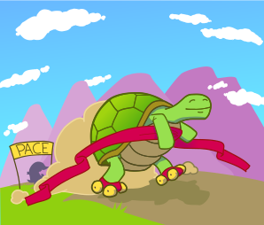

## Why?

- Develop your coding skills!
- Learn about cool algorithms!
- Write a Bachelor/Master thesis! Earn CP as a _Forschungsprojekt_ or _Praktikum_! (Or just do this for fun!)

## Who?

**Students and researchers** at any level can participate.
You are strongly encouraged to work in a **group**.

## What?

PACE is a yearly, international **implementation challenge**. This year's challenge is to compute the twin-width of a given graph. The twin-width is a recently defined graph parameter that measures the simplicity of the graph.

If you want, you and your team can submit the implementation to the PACE challenge. Your implementation will then compete with implementations written by other teams around the world.

**Learn more...**

- [Definition of twin-width](https://en.wikipedia.org/wiki/Twin-width)
- [PACE 2023 challenge description](https://pacechallenge.org/2023/)
- [The goals of PACE](https://pacechallenge.org/about/)

## How?

- Please email us at [tcs-projects@dlist.server.uni-frankfurt.de](mailto:tcs-projects@dlist.server.uni-frankfurt.de)
- We will have regular meetings and build a small community.
- The first meeting is in Mid October. (date to be determined)
- If you want to start familiarizing yourself with the topic, you can watch the videos of last year's [Parameterized Algorithms course](https://tcs.uni-frankfurt.de/teaching/winter20/ati/) (in German) and read the corresponding book [[pdf](https://www.mimuw.edu.pl/~malcin/book/parameterized-algorithms.pdf)]. Relevant topics are the first couple of weeks of that course.
