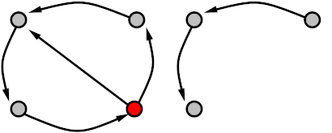

## Why?

- Develop your coding skills!
- Learn about cool algorithms!
- Write a Bachelor/Master thesis! Earn CP as a _Forschungsprojekt_ or _Praktikum_! (Or just do this for fun!)

## Who?

**Students and researchers** at any level can participate.
You are strongly encouraged to work in a **group**.

## What?

PACE is a yearly, international **implementation challenge**. This year's challenge is to identify and implement an efficient algorithm that finds the smallest Directed Feedback Vertex Set in a given graph. In Directed Feedback Vertex Set, the input is a directed graph and we are asked to delete as few vertices as possible to make the graph acyclic:

If you want, you and your team can submit the implementation to the PACE challenge. Your implementation will then compete with implementations written by other teams around the world.

**Learn more about**

- [Directed Feedback Vertex Set](https://pacechallenge.org/2022/directed-fvs/)
- [The detailed rules of this year's challenge](https://pacechallenge.org/2022/)
- [The goals of PACE](https://pacechallenge.org/about/)

## How?

- Register in [Moodle](https://moodle.studiumdigitale.uni-frankfurt.de/moodle/course/view.php?id=2369) (the password is `turtle`).
- We will have regular meetings and build a small community.
- The first meeting is in Mid-Late October. (date to be determined)
- If you want to start familiarizing yourself with the topic, you can watch the videos of last year's [Parameterized Algorithms course](https://tcs.uni-frankfurt.de/teaching/winter20/ati/) (in German) and read the corresponding book [[pdf](https://www.mimuw.edu.pl/~malcin/book/parameterized-algorithms.pdf)]. Relevant topics are: Kernelization, Bounded Search Trees, and Iterative Compression (that is, weeks 1 and 2 of the course). An algorithm for the Directed Feedback Vertex Set problem is described in Chapter 8.6. (Note that you *will* need to understand the prerequisites first, in order to understand the algorithm described in this chapter.)
